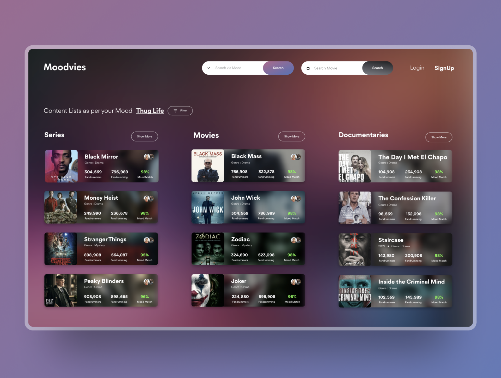

# React Movie Search

Simple Search Movie App with The Movie DB API

## Project’s idea

The design was inspired from Dribble and created by [Rehan Khurshid](https://dribbble.com/rehankhurshid)



### How to use it in local ?

1. Clone the project
2. Install dependencies

```
npm install
```

3. Obtain an API key by following the instructions from [The Movie DataBase API](https://developers.themoviedb.org/3/getting-started/introduction)

4. Create a [`.env`](https://github.com/motdotla/dotenv) file in the root directory of your project. Add environment-specific variables.
   If you use react add this for the name:

```dosini
REACT_APP_API_KEY=your-api-key
```

As early as possible in your application, require and configure dotenv.

```javascript
require("dotenv").config();
```

`.process.env` now has the keys and values you defined in your file

```
process.env.REACT_APP_API_KEY
```

5. Run the project

```
npm start
```

### Stack

React
Javascript
Sass

### Author

MaxHiit
